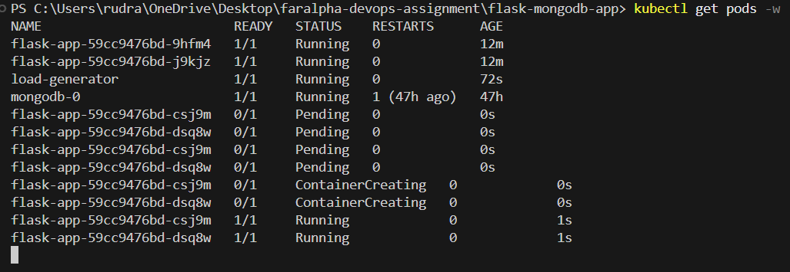

# Screenshots for Kubernetes Assignment (AUTOSCALING)

# Screenshot 1 — HPA Running Properly

# Initial Pods (Before CPU Load)
.png)

# Load Generator Running (High Traffic)
.png)

# Autoscaling Pods UP

# Autoscaling Pods DOWN

